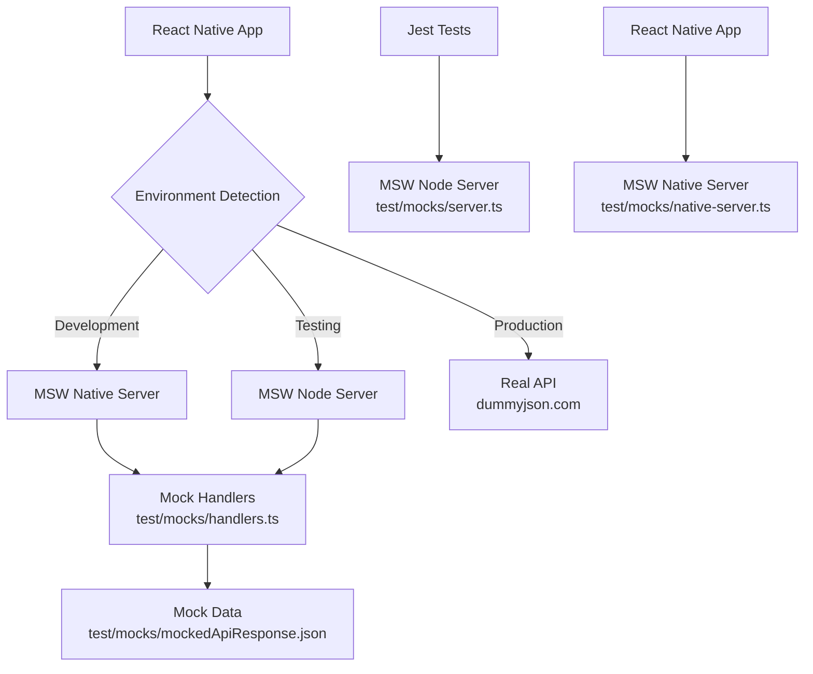

# MSW Network Mocking Guide

## 📋 Table of Contents

1. [Overview](#overview)
2. [Architecture](#architecture)
3. [Quick Start](#quick-start)
4. [Configuration](#configuration)
5. [Development Usage](#development-usage)
6. [Testing](#testing)
7. [File Structure](#file-structure)
8. [Customization](#customization)
9. [Troubleshooting](#troubleshooting)

## Overview

This project uses **Mock Service Worker (MSW)** for network layer mocking in both development and testing. MSW provides seamless API mocking by intercepting requests at the network level, offering a more realistic testing environment compared to traditional mocking approaches.

### Key Benefits

- 🚀 **Seamless Development** - No separate mock server needed
- 🔒 **Reliable Testing** - Controlled responses eliminate flaky tests
- 🌐 **Network-level Interception** - Works with any HTTP client
- 🎯 **Scenario Testing** - Easy to test error cases and edge conditions
- 🔄 **Shared Handlers** - Same mocks for unit, integration, and E2E tests
- 📱 **React Native Compatible** - Works on iOS, Android, and web

## Architecture



### Components

| Component | Purpose | Location |
|-----------|---------|----------|
| **MSW Handlers** | Request/response definitions | `test/mocks/handlers.ts` |
| **Node Server** | Jest testing environment | `test/mocks/server.ts` |
| **Native Server** | React Native runtime | `test/mocks/native-server.ts` |
| **Mock Data** | Shared response data | `test/mocks/mockedApiResponse.json` |
| **Polyfills** | React Native compatibility | `msw.polyfills.js` |

## Quick Start

### 🎯 Development

MSW is automatically enabled in development mode. Just start your app:

```bash
# Start the development server
yarn start

# Run on iOS simulator
yarn ios

# Run on Android emulator
yarn android
```

You'll see MSW activation logs in the console:
```
🎭 MSW mocking enabled in development
-----------MSW mocking users data----------
```

### 🧪 Testing

Run tests with MSW automatically handling API calls:

```bash
# Run all tests
yarn test

# Run tests in watch mode
yarn test --watch

# Run specific test file
yarn test ListWithFetch.test.tsx
```

## Configuration

### Environment Detection

The app automatically uses MSW in development and testing:

```typescript
// src/config/environment.ts
const isTestEnvironment =
  __DEV__ &&
  (process.env.NODE_ENV === 'test' || (global as any).__MAESTRO__ || false);

// MSW intercepts requests to this URL in development
const BASE_URL = 'https://dummyjson.com';
```

### MSW Handlers

Handlers define which requests to intercept and what responses to return:

```typescript
// test/mocks/handlers.ts
export const handlers = [
  rest.get('*/users', (req, res, ctx) => {
    return res(ctx.json(mockedApiResponse));
  }),
  
  rest.get('*/users/:id', (req, res, ctx) => {
    const userId = Number(req.params.id);
    const user = mockedApiResponse.users.find(u => u.id === userId);
    return user 
      ? res(ctx.json(user))
      : res(ctx.status(404), ctx.json({ message: 'User not found' }));
  }),
];
```

## Development Usage

### Adding New Endpoints

1. Add handler to `test/mocks/handlers.ts`:

```typescript
rest.post('*/users', (req, res, ctx) => {
  const newUser = req.body;
  return res(ctx.status(201), ctx.json({ id: 999, ...newUser }));
}),
```

2. Mock data will be automatically available in both development and testing.

### Simulating Errors

```typescript
rest.get('*/users', (req, res, ctx) => {
  return res(ctx.status(500), ctx.json({ error: 'Server error' }));
}),
```

### Dynamic Responses

```typescript
rest.get('*/users', (req, res, ctx) => {
  const limit = req.url.searchParams.get('limit');
  const users = mockedApiResponse.users.slice(0, Number(limit) || 30);
  return res(ctx.json({ users, total: users.length }));
}),
```

## Testing

### Basic Test Setup

MSW is automatically configured in `jest.setup.js`:

```typescript
import {server} from './test/mocks/server';

beforeAll(() => server.listen());
afterAll(() => server.close());
afterEach(() => server.resetHandlers());
```

### Overriding Handlers in Tests

```typescript
test('handles server error', async () => {
  server.resetHandlers(
    rest.get('https://dummyjson.com/users', (req, res, ctx) => {
      return res(ctx.status(500));
    }),
  );
  
  render(<ListWithFetch />);
  expect(await screen.findByText(/error/i)).toBeOnTheScreen();
});
```

### Testing Different Scenarios

```typescript
test('displays custom mock data', async () => {
  const customData = { users: [{ id: 1, name: 'Test User' }] };
  
  server.resetHandlers(
    rest.get('https://dummyjson.com/users', (req, res, ctx) => {
      return res(ctx.json(customData));
    }),
  );
  
  render(<ListWithFetch />);
  expect(await screen.findByText('Test User')).toBeOnTheScreen();
});
```

## File Structure

```
my-app/
├── msw.polyfills.js              # React Native polyfills
├── test/mocks/
│   ├── handlers.ts               # MSW request handlers
│   ├── server.ts                 # MSW server for Jest
│   ├── native-server.ts          # MSW server for React Native
│   └── mockedApiResponse.json    # Mock response data
├── jest.setup.js                 # Jest + MSW configuration
└── src/config/environment.ts     # Environment configuration
```

## Customization

### Adding Request Logging

```typescript
rest.get('*/users', (req, res, ctx) => {
  console.log('Request URL:', req.url.toString());
  console.log('Request headers:', req.headers.all());
  return res(ctx.json(mockedApiResponse));
}),
```

### Conditional Responses

```typescript
rest.get('*/users', (req, res, ctx) => {
  const userAgent = req.headers.get('user-agent');
  if (userAgent?.includes('TestAgent')) {
    return res(ctx.json({ test: true }));
  }
  return res(ctx.json(mockedApiResponse));
}),
```

### Response Delays

```typescript
rest.get('*/users', (req, res, ctx) => {
  return res(
    ctx.delay(1000), // 1 second delay
    ctx.json(mockedApiResponse)
  );
}),
```

## Troubleshooting

### Common Issues

**MSW not intercepting requests:**
- Ensure polyfills are imported: `import './msw.polyfills'`
- Check console for MSW activation message
- Verify handlers match request URLs exactly

**Tests failing with network errors:**
- Ensure `jest.setup.js` is configured correctly
- Check that MSW server is started in `beforeAll`
- Verify handler patterns match test requests

**React Native build errors:**
- Use `msw/native` for React Native runtime
- Use `msw/node` for Jest testing
- Ensure polyfills are installed: `react-native-url-polyfill`, `fast-text-encoding`

### Debugging

Enable MSW debugging:

```typescript
server.listen({
  onUnhandledRequest: 'warn', // Log unhandled requests
});
```

Check request patterns:

```typescript
rest.get('*', (req, res, ctx) => {
  console.log('Intercepted:', req.method, req.url.toString());
  return req.passthrough(); // Pass through to real API
}),
```

## Migration from WireMock

This project has been migrated from WireMock to MSW for better integration and developer experience:

### Benefits of MSW over WireMock

| Feature | MSW | WireMock |
|---------|-----|----------|
| **Setup** | Zero configuration | Java + standalone server |
| **Integration** | Native JS/TS | External process |
| **Hot Reload** | ✅ Instant | ❌ Restart required |
| **Network Level** | ✅ Real interception | ✅ Server proxy |
| **React Native** | ✅ Native support | ⚠️ Requires setup |
| **Testing** | ✅ Same handlers | ❌ Separate config |

### What Changed

- ✅ **Removed**: WireMock JAR files, shell scripts, separate server
- ✅ **Added**: MSW handlers, polyfills, integrated mocking
- ✅ **Simplified**: Single configuration for dev and test
- ✅ **Improved**: Faster startup, better DX, easier debugging

---

## Best Practices

1. **Keep Handlers Simple** - Focus on essential request/response patterns
2. **Use Real Data Structure** - Match production API responses exactly
3. **Test Error Cases** - Use MSW to simulate network failures
4. **Share Mock Data** - Reuse response files across handlers
5. **Document Endpoints** - Comment complex handler logic
6. **Reset Between Tests** - Use `server.resetHandlers()` in `afterEach`

For more MSW documentation, visit: https://mswjs.io/docs/