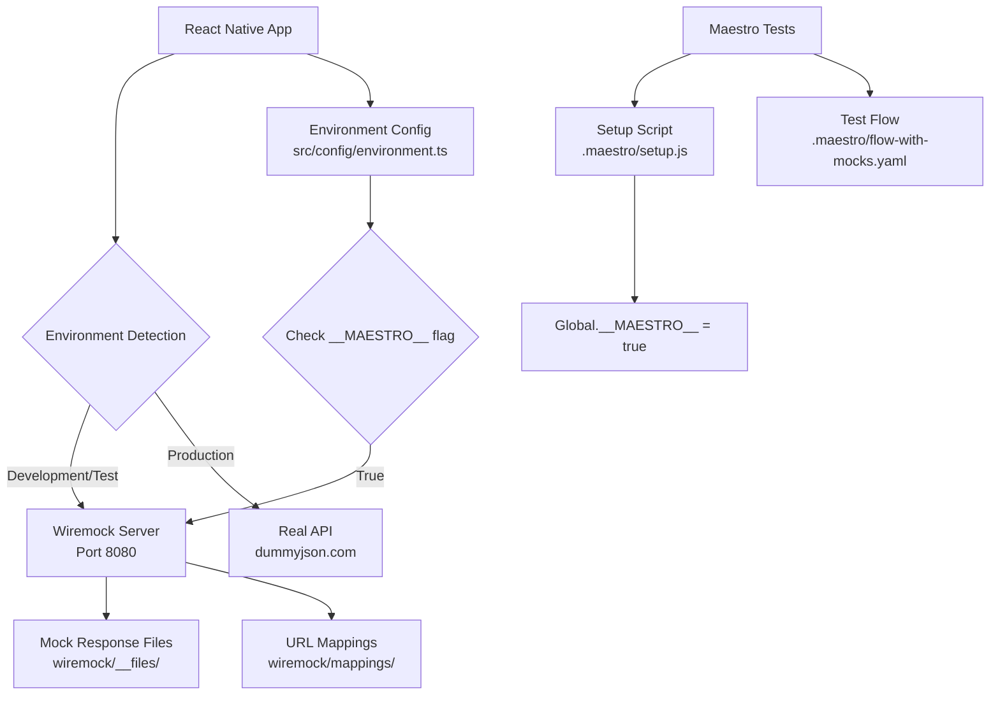

# Wiremock & Maestro Testing Guide

## 📋 Table of Contents

1. [Overview](#overview)
2. [Architecture](#architecture)
3. [Quick Start](#quick-start)
4. [Configuration](#configuration)
5. [Test Execution](#test-execution)
6. [File Structure](#file-structure)
7. [Customization](#customization)
8. [Troubleshooting](#troubleshooting)
9. [Advanced Usage](#advanced-usage)

## Overview

This project uses **Wiremock** as a standalone mock server and **Maestro** for end-to-end mobile testing. This setup provides reliable, fast, and offline testing by intercepting network requests and serving predefined mock responses.

### Key Benefits

- 🚀 **Fast execution** - No dependency on external APIs
- 🔒 **Reliable tests** - Controlled responses eliminate flaky tests
- 🌐 **Offline testing** - No internet connection required
- 🎯 **Scenario testing** - Test error cases and edge conditions
- 🔄 **Reusable data** - Same mocks for unit and E2E tests
- 📱 **Cross-platform** - Works on Android and iOS

## Architecture



### Components

| Component | Purpose | Location |
|-----------|---------|----------|
| **Wiremock Server** | HTTP mock server | `wiremock/` directory |
| **Environment Config** | Runtime environment detection | `src/config/environment.ts` |
| **Maestro Tests** | E2E test automation | `.maestro/` directory |
| **Mock Data** | Shared response data | `test/mocks/` & `wiremock/__files/` |
| **Shell Scripts** | Automation tools | `scripts/` directory |

## Quick Start

### 🎯 One-Command Testing

```bash
# Run complete test suite with automatic setup/cleanup
./scripts/run-maestro-tests.sh
```

This single command will:
1. Download Wiremock (if needed)
2. Start the mock server
3. Execute all Maestro tests
4. Clean up when finished

### 🔧 Manual Control

```bash
# 1. Start Wiremock server
./scripts/setup-wiremock.sh

# 2. Run specific test file
maestro test .maestro/flow-with-mocks.yaml

# 3. Stop Wiremock when done
./scripts/stop-wiremock.sh
```

## Configuration

### Environment Detection

The app automatically switches between mock and real APIs based on runtime conditions:

```typescript
// src/config/environment.ts
const isTestEnvironment =
  __DEV__ &&
  (process.env.NODE_ENV === 'test' || (global as any).__MAESTRO__ || false);

const BASE_URL = __DEV__
  ? Platform.OS === 'android' 
    ? `http://10.0.2.2:8080`     // Android emulator
    : `http://localhost:8080`    // iOS simulator
  : 'https://dummyjson.com';     // Production
```

### Network Endpoints

| Platform | URL | Notes |
|----------|-----|-------|
| **Android Emulator** | `http://10.0.2.2:8080` | Maps to host machine |
| **iOS Simulator** | `http://localhost:8080` | Direct localhost access |
| **Physical Device** | `http://{YOUR_IP}:8080` | Update `DEVELOPMENT_HOST` |
| **Production** | `https://dummyjson.com` | Real API |

### Wiremock Configuration

**URL Mapping** (`wiremock/mappings/users.json`):
```json
{
  "request": {
    "method": "GET",
    "urlPathPattern": "/users.*"
  },
  "response": {
    "status": 200,
    "headers": {
      "Content-Type": "application/json"
    },
    "bodyFileName": "users-response.json"
  }
}
```

**Mock Data** (`wiremock/__files/users-response.json`):
- Contains 30 user records with complete profile data
- Mirrors the structure of the real DummyJSON API
- First user: "Umair Medhurst" (used in test assertions)

## Test Execution

### Maestro Test Flow

1. **App Launch** (`flow-with-mocks.yaml`)
   ```yaml
   - launchApp:
       clearState: true
   ```

2. **Environment Setup** 
   ```yaml
   - runScript: ./setup.js  # Sets global.__MAESTRO__ = true
   ```

3. **Assertions**
   ```yaml
   - extendedWaitUntil:
       visible: "Umair Medhurst"  # First user from mock data
       timeout: 10000
   
   - assertVisible:
       id: "1-user-container"    # First item container
   
   - assertVisible:
       text: "atuny0@sohu.com"   # Specific mock email
   ```

4. **Interaction Testing**
   ```yaml
   - scrollUntilVisible:
       element:
         id: "15-user-container" # Scroll to 15th item
       direction: 'DOWN'
   ```

### Test Data Verification

The tests verify mock data is being used by checking for:
- Specific user names from mock data ("Umair Medhurst")
- Email addresses that exist only in mock data
- UI elements with predictable IDs based on mock data

## File Structure

```
my-app/
├── .maestro/                     # Maestro test files
│   ├── setup.js                 # Test environment setup
│   ├── flow-with-mocks.yaml     # Main test flow
│   └── flow.yaml                # Alternative test flow
├── scripts/                     # Automation scripts
│   ├── setup-wiremock.sh        # Start Wiremock server
│   ├── stop-wiremock.sh         # Stop Wiremock server
│   └── run-maestro-tests.sh     # Complete test runner
├── src/config/
│   └── environment.ts           # Runtime environment detection
├── test/mocks/
│   └── mockedApiResponse.json   # Original mock data source
├── wiremock/
│   ├── mappings/
│   │   └── users.json           # URL mapping configuration
│   ├── __files/
│   │   └── users-response.json  # Mock response data
│   └── wiremock-jre8-standalone-2.35.0.jar  # Downloaded automatically
└── README-network-mocking.md    # Existing documentation
```

## Customization

### Adding New Endpoints

1. **Create mapping file:**
   ```bash
   # wiremock/mappings/products.json
   {
     "request": {
       "method": "GET",
       "urlPathPattern": "/products.*"
     },
     "response": {
       "status": 200,
       "headers": {
         "Content-Type": "application/json"
       },
       "bodyFileName": "products-response.json"
     }
   }
   ```

2. **Add response file:**
   ```bash
   # wiremock/__files/products-response.json
   {
     "products": [
       {"id": 1, "name": "Test Product", "price": 29.99}
     ]
   }
   ```

### Error Scenario Testing

Create conditional responses for testing error states:

```json
{
  "request": {
    "method": "GET",
    "urlPathPattern": "/users.*",
    "queryParameters": {
      "error": {"equalTo": "500"}
    }
  },
  "response": {
    "status": 500,
    "headers": {
      "Content-Type": "application/json"
    },
    "jsonBody": {
      "error": "Internal Server Error",
      "message": "Database connection failed"
    }
  }
}
```

### Physical Device Testing

For testing on physical devices, update the configuration:

```typescript
// src/config/environment.ts
const DEVELOPMENT_HOST = '192.168.1.100'; // Your computer's IP address
```

Find your IP address:
- **macOS**: `ipconfig getifaddr en0`
- **Linux**: `hostname -I`
- **Windows**: `ipconfig` (look for IPv4 Address)

## Troubleshooting

### Common Issues

#### 🚫 Wiremock Won't Start

**Symptoms**: Script hangs or shows connection errors

**Solutions**:
```bash
# Check if Java is installed
java -version

# Check if port 8080 is in use
lsof -i :8080

# Kill existing processes on port 8080
kill $(lsof -t -i:8080)
```

#### 🌐 App Still Hitting Real API

**Symptoms**: Real data appears instead of mock data

**Debugging Steps**:
1. Check debug logs in Metro bundler console
2. Verify Wiremock is running: `curl http://localhost:8080/__admin/health`
3. Confirm environment flag: Look for debug output showing `__MAESTRO__: true`

**Common Fixes**:
- Restart the app to pick up environment changes
- Verify Maestro setup script is running
- Check network URL configuration for your platform

#### 📱 Network Requests Failing

**Platform-specific URLs**:

| Issue | Platform | Solution |
|-------|----------|----------|
| Connection refused | Android Emulator | Use `http://10.0.2.2:8080` |
| Timeout | iOS Simulator | Use `http://localhost:8080` |
| Can't connect | Physical Device | Update `DEVELOPMENT_HOST` to your IP |

#### 🎭 Maestro Tests Failing

**Debug Test Environment**:
```bash
# Verify Maestro can reach the app
maestro test .maestro/setup.js --verbose

# Check if mock data is loaded
curl http://localhost:8080/users | jq '.users[0].firstName'
# Should return: "Umair"
```

### Logs and Debugging

**Wiremock Admin Interface**: http://localhost:8080/__admin

**View Request History**:
```bash
curl http://localhost:8080/__admin/requests | jq
```

**App Debug Output**: Check Metro console for environment configuration logs.

## Advanced Usage

### CI/CD Integration

```yaml
# .github/workflows/e2e-tests.yml
name: E2E Tests
on: [push, pull_request]

jobs:
  test:
    runs-on: ubuntu-latest
    steps:
      - uses: actions/checkout@v3
      - name: Setup Node.js
        uses: actions/setup-node@v3
        with:
          node-version: '18'
      - name: Install dependencies
        run: yarn install
      - name: Run E2E tests
        run: ./scripts/run-maestro-tests.sh
```

### Custom Test Data

```bash
# Generate test data for specific scenarios
./scripts/setup-wiremock.sh --data-file test/mocks/error-scenarios.json
```

### Performance Testing

```yaml
# .maestro/performance-flow.yaml
- launchApp
- runScript: ./setup.js
- repeat:
    times: 10
    commands:
      - tapOn: "refresh-button"
      - extendedWaitUntil:
          visible: "Umair Medhurst"
          timeout: 5000
```

### Load Testing Wiremock

```bash
# Test mock server performance
ab -n 1000 -c 10 http://localhost:8080/users
```

---

## Summary

This testing infrastructure provides:

- **Automated test execution** with cleanup
- **Cross-platform compatibility** (Android/iOS)
- **Flexible mock data management** 
- **Environment-aware configuration**
- **Comprehensive debugging tools**

The combination of Wiremock and Maestro creates a robust testing environment that ensures your app works reliably across different scenarios while maintaining fast feedback loops during development.

For quick reference, bookmark these key commands:

```bash
# Complete test run
./scripts/run-maestro-tests.sh

# Manual control
./scripts/setup-wiremock.sh && maestro test .maestro/

# Debug
curl http://localhost:8080/__admin/health
``` 